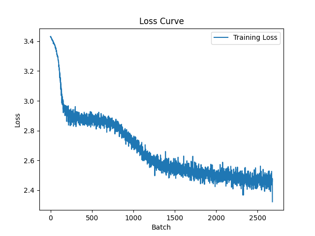

# LLM Transformer Project
=======================
### MATH598C: LLMs

We have implemented a transformer from scratch using the PyTorch python library. 

## Quickstart

```bash
# 1. Clone the repository
git clone https://github.com/melody-gold/math598-llm-project.git
cd math598-llm-project
```
(or use ssh)
``` bash
# 2. Install dependencies
uv sync

# 3. Run tests
pytest

# 4. Train the model and generate text
uv run main.py
```

Running `main.py` will automatically download the dataset, print untrained and trained model generations, save a loss curve to `loss_curve.png`, and save results to `results.txt`. No manual data download is required.


### In this Repository:
| `main.py` | Entry point — runs the full pipeline end to end |
| `model.py` | `MLP`, `AttentionHead`, `TransformerBlock`, and `transformer` classes |
| `config.py` | `Config` dataclass for all model hyperparameters |
| `tokenizer.py` | Character-level tokenizer with encode/decode |
| `dataset.py` | `Book_Dataset` — loads and tokenizes the text corpus |
| `train.py` | Training loop, model save/load utilities |
| `transformer.ipynb` | Notebook with markdown writeup, training runs, and output cells |
| `conftest.py` | pytest path setup |
| `test_transformer.py` | Unit and integration tests |
| `pyproject.toml` | Dependencies and project metadata |
| `contributions.md` | Individual contributions by group member |


## Dataset

The model is trained on a book sourced from [Project Gutenberg](https://www.gutenberg.org/files/67098/67098-0.txt), downloaded automatically at runtime. The first 500,000 characters starting from Chapter I are used. The dataset is fetched and preprocessed entirely in `main.py` — no manual download step is needed.


## Results
Model parameter count: 1,600,256
Training time: 185.5s
Final avg loss: 2.6863

UNTRAINED MODEL GENERATION
Seed: 'the captain said'
Output:
the captain saidv?l!æzacæjx?r.bqksj.oyc?agzyuenjgayllqit wglygytqpnu?.mc?. y!rb!!ltpvl!xgzqqhbzwnqc??o.arvæhwcqve ?v

TRAINED MODEL GENERATION
Seed: 'the captain said'
Output:
the captain said t os iyo ad le angun tthid wile toun athignd.ind retto heral suf thoukid arigle uis acocohire?ang b

Loss Plot:



Contributions:
See contributions.md
